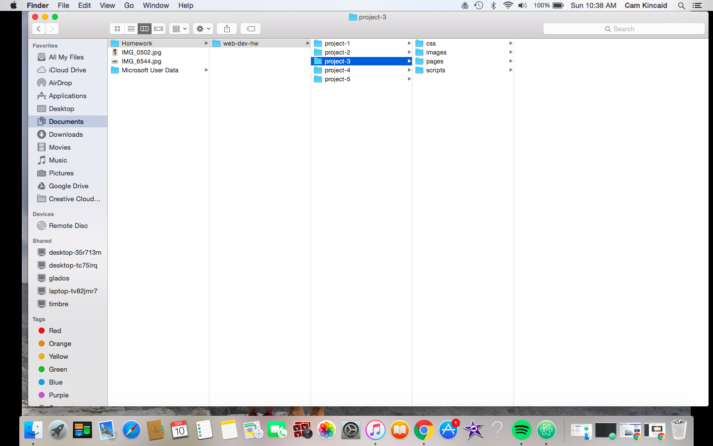

# My First README.md

## Cam Kincaid
**Wow** - This is my first time coding! At first it seemed extremely overwhelming and confusing. But now I'm  starting to get a hang of it and it's actually pretty fun!

I *really really* hope I am able to keep up with the material in this class.

Things I learned about:
1.  What the internet is
2. How the internet works

  * This unordered sublist took me **10 minutes** to figure out
  * How do I get rid of the indent?

``This is my inline code``

 ***
[Here is the link to our class page!](https://media-ed-online.github.io/intro-web-dev/)

This is the screenshot of my folders...
